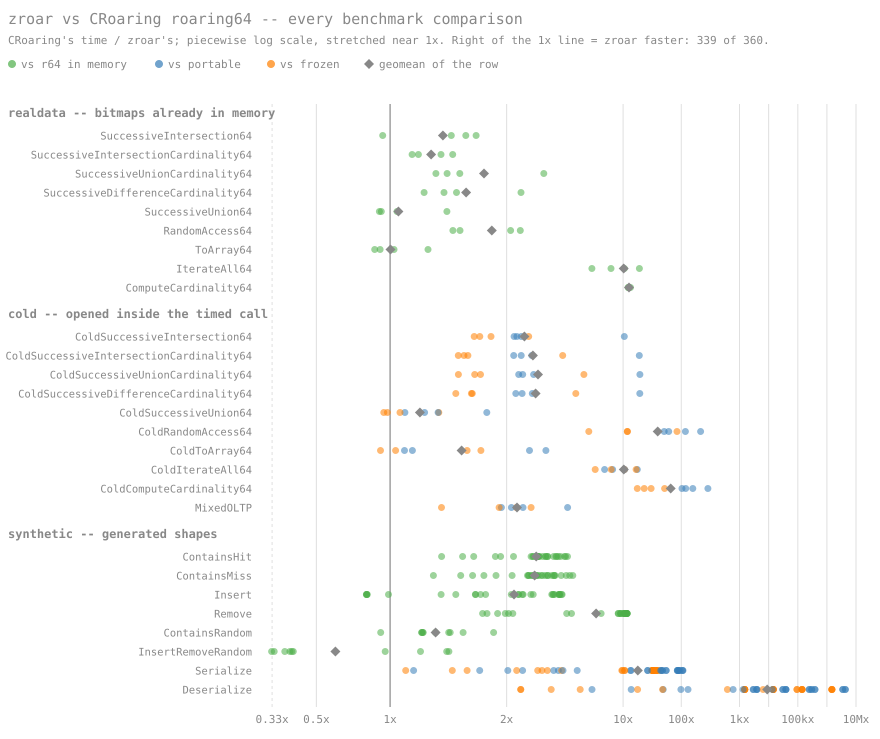

# zroar - Serialized Roaring Bitmaps in Zig

zroar is a ground-up implementation of the popular [roaring
bitmaps](https://roaringbitmap.org/) data structure in a serialized form. zroar
keeps all the MSB 48-bit keys (high48) and containers in a single flat byte
buffer, so the **in-memory form of zroar is the serialized form,** which can then be
stored to disk or sent over the network as is. When opening a zroar buffer,
there's no parsing or per-container allocation. All read/write operations can be
done on the buffer immediately.

```
zroar — one single buffer

  ┌───────────────────────────┐   toBuffer():   the buffer, as is
  │        flat buffer        │
  │   in memory == on disk    │   fromBuffer(): pointer cast +
  └───────────────────────────┘                 version check, ~ns
```

zroar is available under the Apache v2.0 [License](LICENSE). Benchmark Report:
[BENCHMARKS](BENCHMARKS.md). Layout: [DESIGN](DESIGN.md). zroar is inspired by
my earlier work on [sroar](https://github.com/manishrjain/sroar), written in Go.

## Benchmarks Against CRoaring

For benchmarks, we ported the
[CRoaring](https://github.com/roaringBitmap/CRoaring) benchmark suite to Zig. We
expanded the benchmarks into warm open and cold open. Warm open means the bitmap
is already in its in-memory format before benchmarking begins. Cold open adds a
deserialization step upfront, which is what you'd expect to do in a database
when reading a posting list stored as a byte array. For cold open, the
benchmarks test both the *frozen* and the *portable* serialization versions of
CRoaring. We also added an OLTP synthetic dataset, which uses a zipfian
distribution of posting list sizes.

**By design, zroar performs 2x to 9x faster** (geometric mean across test
cases) than CRoaring on both warm and cold open benchmarks. zroar runs up to
600x faster on serialization and deserialization. For cardinality computations,
zroar is 4.8x faster (geometric mean), going up to ~290x on cold opens.

In fact, **zroar is faster in 339 of 360 benchmark cases run** -- the main exception
is random interleaved insert/remove, covered under downsides. All benchmarks
were done with the latest version of CRoaring 5.0 (released Aug 2026), on a
Ryzen 9 5950X with the benchmark process pinned to a core, fixed at 4.00 GHz.

Every number below is CRoaring's time ÷ zroar's on the same benchmark — above
1 means zroar is faster.

| headline | # tests | vs CRoaring | vs frozen |
|---|---|---|---|
| realdata, bitmaps in memory (all data sets) | 36 | 2.20× | – |
| cold, every bitmap opened inside the call (all data sets) | 40 | 6.92× (portable) | 3.44× |
| synthetic, operations (Contains/Insert/Remove/Random; families weighted equally) | 132 | 2.18× | – |
| synthetic, Serialize + Deserialize | 56 | 615× (portable) | 259× |
| synthetic, all families | 188 | 8.92× (portable where a format is involved) | – |

By total wall-clock per data set (summing every row, where the expensive rows
dominate as they would in a workload), zroar is 1.5x-6.8x faster warm and
1.8x-5.7x on cold opens — see [BENCHMARKS](BENCHMARKS.md) for the per-dataset
detail.

Every benchmark comparison, one dot each (click through for hover details
naming each test):

[](static/bench-plot.svg)

## Why zroar and Why Is It Faster?

zroar was originally designed for systems which keep their posting lists /
inverted indexes on disk, or have to send them over the network. The design goal
for zroar is to ensure that the serialized form can readily do both read and
write operations without any performance penalty of a deserialization step.

However, zroar has proven to be more efficient than CRoaring even for warm,
purely in-memory operations, with no deserialization step involved. I believe
this design can be applied to a Roaring Bitmaps library in any language to
achieve a significant performance boost (also proven by sroar in Go originally).

Roaring bitmaps split each integer into two parts: the most significant 48 bits
(high48) and the least significant 16 (low16). The high48 goes into an index,
which points to a container; the container stores the low16 of every integer
sharing that high48. Depending upon how many integers are present, the
container could be a sorted 16-bit unsigned int array, or a 65,536-bit bitmap.

```
CRoaring — reaching a container is a chain of dependent loads,
every box a separate heap allocation:

  art_t ──► node ──► leaf ──► containers[i] ──► header ──► payload
            └─ ART ──┘           ptr array       struct     the bits
              2-3 nodes

  each arrow is a load whose address comes out of the previous load:
  nothing to prefetch, and any arrow can be a cache miss.
```

CRoaring keeps the high48 index in an adaptive radix tree (ART), and allocates
each container separately on the heap. Reaching a container means walking the
ART — one byte of the high48 per level, typically 2–3 levels after path
compression — and then following three more pointers: the ART leaf holds an
index into a containers array, whose entry points to a container header, which
points to the payload. That's five to six dependent memory loads, each waiting
on the address from the previous one, and each a potential cache miss.

```
zroar — one buffer, offsets instead of pointers:

  ┌───────────────────────────┬──────┬────────────┬──────┬─────┐
  │  sorted (high48, offset)  │  C0  │     C1     │  C2  │ ... │
  │  pairs (the keys node)    │      │            │      │     │
  └─────────────┬─────────────┴──────┴────────────┴──────┴─────┘
                │  binary search + scan               ▲
                └────────── offset add ───────────────┘

  the search touches a few adjacent cache lines in one place;
  the "dereference" is an add into the same buffer.

  every container starts with an 8-byte header, payload right behind:

       C1, zoomed in
  ┌───────┬───────┬─────────────┬───────────────────────────────┐
  │ size  │ type  │ cardinality │ payload                       │
  │ (u16) │ (u16) │    (u32)    │ array:  sorted low16 values   │
  │       │       │             │ bitmap: 65,536 bits           │
  └───────┴───────┴─────────────┴───────────────────────────────┘
```

**zroar flips that design** by allocating one flat buffer for everything. The
front of the buffer keeps sorted (high48, offset) pairs, where the offset says
where in the same buffer the container lives. The container in turn starts
with a small header: size of container (u16), type of container (array or
bitmap, u16), and cardinality (number of integers the container holds, u32).
Reaching a container is a binary search over the sorted pairs plus one offset
add — no pointers anywhere, which is also why the buffer itself is the
serialized form.

## Using It

    zig fetch --save git+https://github.com/manishrjain/zroar

```zig
// build.zig
const zroar = b.dependency("zroar", .{ .target = target, .optimize = optimize });
exe.root_module.addImport("zroar", zroar.module("zroar"));
```

```zig
const zroar = @import("zroar");

var bm = try zroar.Bitmap.init(allocator);
defer bm.deinit();

_ = try bm.set(42);
_ = try bm.set(1 << 40);
assert(bm.contains(42));
assert(bm.getCardinality() == 2);

// For long term storage (database), you might want to run an
// optional step of 'compact', which achieves the smallest possible size.
try bm.compact(); // OPTIONAL

const bytes = bm.toBuffer();
// write to disk or ship bytes over the network.

// Open: O(1). With .borrow, `bytes` is never touched; the first
// mutation copies it out. Pass .own to hand the buffer over instead.
var bm2 = try zroar.Bitmap.fromBuffer(allocator, bytes, .borrow);
defer bm2.deinit();

var it = bm2.iterator();
while (it.next()) |v| { ... }
```

Set algebra: `And`/`Or`/`fastOr` (materializing), `andInPlace`/`orInPlace`/
`andNotInPlace`, and fused `{and,or,andNot}Cardinality` that count without
materializing.

## Build and Test

    zig build test          # unit + property tests (Debug and ReleaseSafe)
    zig build searchbench   # keys/array search microbench, no dependencies

## Benchmarks Against CRoaring

    bench/fetch_croaring.sh                  # clone CRoaring + realdata into /tmp/CRoaring
    bench/run_all.sh -o results/run          # full suite, pinned; writes .tsv + report.md
    zig build bench -- <data_dir> [--suite realdata|synthetic|cold] [--out <tsv>]
    zig build difftest                       # differential test vs roaring64 (~2 s) for correctness verification
    zig build difftest -- --soak 300         # same, fresh seeds until time is up

`<data_dir>` is any `benchmarks/realdata/<set>` directory of the CRoaring
checkout. CRoaring elsewhere than /tmp/CRoaring: `-Dcroaring=<dir>`.

## Status

Zig 0.16. Format version 1 (the buffer's first two bytes; other versions are
refused). Buffers are trusted input — integrity checks belong a layer above.
No run containers, no 32-bit variant.

## zroar Design Advantages Over CRoaring

1. **No pointer chasing**

As described above, in CRoaring, reaching a container takes five to six
dependent memory loads (the ART walk plus three pointer hops). Every load waits
on the address from the previous one, and each could be a cache-miss.

zroar has no pointers, only offsets. All the high48 keys are kept grouped and
sorted, so we can binary search and linear scan over them without any pointer
chasing, and most likely using the same cache lines that were already touched.

2. **Data locality**

In CRoaring, container n and n+1 live wherever malloc happens to put them, which
might be pages apart. The hardware prefetcher sees no pattern.

In zroar, all the containers are colocated tightly (even accounting for a little
bit of slack kept in array containers to grow). Reading the containers just
walks forward in the same underlying buffer -- the access pattern the hardware
prefetcher is built for.

3. **No small allocations**

CRoaring allocates memory per container, which leads to lots of small
allocations, one per container, then many times as the container grows.

zroar grows by remap/realloc of the entire buffer. This reduces the number of
allocations and avoids memory fragmentation.

Though, this is also the main case where CRoaring outperforms zroar -- random
interleaved insert/remove. If a container in the middle of the buffer grows,
then to expand that container, zroar has to logically move all the memory to its
right (think inserting in the middle of an array), while CRoaring only has to
expand that one container's memory.

zroar reduces that cost by proactively moving the expanding container to the end
of the buffer to make future expansions cheaper. It further uses remap to
request the memory allocator to update the size of the buffer without moving
memory, making expansion cost close to zero, whenever possible.

```
C1 is full and must grow, but C2 sits right behind it:

  ┌──────┬────┬──────┬────────┐
  │ keys │ C0 │ C1 ! │   C2   │
  └──────┴────┴──────┴────────┘

zroar does not shift C2 (and everything after it) to the right; it
moves C1 to the end instead — one copy — leaving a dead slot that
the keys node no longer points at:

  ┌──────┬────┬──────┬────────┬─────────┐
  │ keys │ C0 │ dead │   C2   │ C1 (2x) │
  └──────┴────┴──────┴────────┴─────────┘

dead slots are bounded: past 25% of the buffer, the next write runs
cleanup, which compacts them away:

  ┌──────┬────┬────────┬─────────┐
  │ keys │ C0 │   C2   │ C1 (2x) │
  └──────┴────┴────────┴─────────┘
```

4. **No serialization / deserialization, frozen/portable, warm/cold**

CRoaring has two deserialization formats: frozen and portable. Frozen
technically is a *cheaper, fixed* view into the serialized format. While frozen
format might seem similar to zroar, it still mallocs O(num containers) to make
the serialized format readable. Being a view, it comes with the limitation that
it does NOT accept any writes. For that, you'd have to re-create the in-memory
form, paying the full cost of deserialization.

The portable format generates a full writeable in-memory form and also requires
full deserialize to use.

```
CRoaring — memory and disk are different forms; every open converts:

  ┌────────────────┐    serialize     ┌───────────┐
  │  object graph  │ ───────────────► │   bytes   │
  │  ART, headers, │                  │  on disk  │
  │  payloads      │ ◄─────────────── │           │
  └────────────────┘    deserialize   └───────────┘
             portable: full parse, alloc per container
             frozen:   O(#containers) mallocs, read-only view;
                       writing means building the graph anyway

zroar — one form; opening is a pointer cast:

  ┌───────────────────────────┐   toBuffer():   the buffer, as is
  │        flat buffer        │
  │   in memory == on disk    │   fromBuffer(): pointer cast +
  └───────────────────────────┘                 version check, ~ns
```

zroar's in-memory format is the serialized format. And the `fromBuffer` is just
a pointer cast and store in the `Bitmap` struct, which takes nanoseconds, making
zroar 600x faster on the serialize/deserialize benchmark compared to CRoaring.

zroar does have a `compact` API, which can be optionally used to make the bitmap
as small as possible (say before long term storage), removing any paddings that
might exist in array containers (to support growth). In this form, zroar takes
<5% extra compared to frozen, and <20% extra compared to portable format.

| set | bitmaps | values | zroar | r64 portable | run-container saving | r64 frozen |
|---|---|---|---|---|---|---|
| census1881 | 200 | 1,003,861 | 2.0 MB | 1.8 MB (0.93× of zroar) | 6% | 1.9 MB (0.97×) |
| census-income | 200 | 6,922,021 | 2.3 MB | 2.1 MB (0.93× of zroar) | 5% | 2.2 MB (0.95×) |
| weather_sept_85 | 200 | 12,870,627 | 8.6 MB | 8.3 MB (0.96× of zroar) | 1% | 8.3 MB (0.97×) |
| oltp | 200 | 2,486,531 | 5.9 MB | 5.0 MB (0.85× of zroar) | 0% | 5.7 MB (0.97×) |

5. **Simpler, smaller codebase**

The zroar codebase is also simple and much smaller. The main logic (excluding tests
and benchmarking code) is ~2000 lines of code, compared to CRoaring's 17,000
lines of code for the 64-bit version (excluding the 32-bit version, tests,
bench). In CRoaring, just roaring64.c and art.c by themselves are >4K LOC.

This is due to the simpler design of zroar: it avoids the need for a complex
adaptive radix tree (ART) implementation, serialization / deserialization, and
frozen views which accommodate the ART; it has two container types instead of
three; and it writes each SIMD kernel once in portable Zig instead of per-ISA
variants plus dispatch.

## zroar Downsides Compared to CRoaring

This is a Zig-only library, with no bindings in other languages yet. It does not
support the portable serialized format of CRoaring, though that could be added
if required (making it work nicely with the broader roaring bitmaps ecosystem).

zroar only supports 64-bit integers currently (I don't have a need for 32-bit
ints).

zroar does not support a third, run container (supported by CRoaring). The run
container adds significant complexity (expecting 1000+ LOC) and the
benefit/applicability to database systems isn't clear, which is what I'm using
zroar for. As such, I didn't include datasets in benchmarks which were designed
to showcase run container efficiency.

All the above are omissions for the sake of simplicity rather than any
limitation in the design of zroar. Over time as needs arise, these features
could be added.

The only case where CRoaring decisively wins 3x against zroar is random
interleaved insert/remove (random writes). This case requires zroar to
constantly move memory slowing it down, while CRoaring can just expand or delete
individual containers.

If writes arrive in batches, sort them first. On sorted inserts, zroar is
1.3x-4x faster, with its advantage growing when many integers end up in the same
container.

